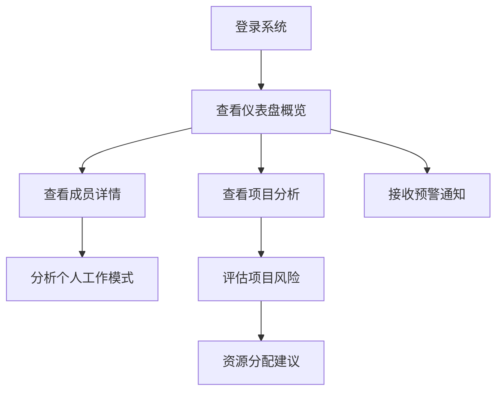

## 1. 产品概述
非侵入式团队健康度仪表盘，通过分析元数据监测团队成员工作状态和项目健康度。
- 解决项目经理无法及时了解团队成员工作状态和项目潜在风险的问题
- 为企业提供数据驱动的团队管理工具，提升项目成功率和团队幸福感

## 2. 核心功能

### 2.1 用户角色
| 角色 | 注册方式 | 核心权限 |
|------|---------|----------|
| 项目经理 | 邮箱注册 | 查看所有团队成员数据，接收预警通知 |
| 团队成员 | 邮箱注册 | 查看个人数据和健康度指标 |

### 2.2 功能模块
1. **仪表盘页面**：团队健康度概览，成员状态卡片，项目风险预警
2. **成员详情页**：个人工作模式分析，健康度历史趋势
3. **项目分析页**：项目进度分析，风险评估，资源分配建议

### 2.3 页面详情
| 页面名称 | 模块名称 | 功能描述 |
|---------|---------|----------|
| 仪表盘页面 | 团队健康度概览 | 展示团队整体健康度评分，成员状态分布，近期预警事件 |
| 仪表盘页面 | 成员状态卡片 | 显示每个团队成员的健康度评分，工作时间分布，最近提交情况 |
| 仪表盘页面 | 项目风险预警 | 展示项目中存在的潜在风险，如技术阻塞、进度延迟等 |
| 成员详情页 | 个人工作模式分析 | 分析个人Git提交时间分布，工作时长，会议占比等数据 |
| 成员详情页 | 健康度历史趋势 | 展示个人健康度指标的历史变化趋势，识别异常模式 |
| 项目分析页 | 项目进度分析 | 分析项目任务完成情况，进度偏差，识别潜在延迟风险 |
| 项目分析页 | 风险评估 | 基于元数据分析，评估项目面临的技术和人员风险 |
| 项目分析页 | 资源分配建议 | 根据团队成员工作负载，提供资源调整建议 |

## 3. 核心流程
项目经理登录系统后，首先查看仪表盘页面了解团队整体状态，然后可以点击具体成员查看详细分析，或进入项目分析页评估项目风险。系统会自动分析收集的元数据，当检测到异常模式时（如连续凌晨提交、任务停滞等），会在仪表盘页面显示预警信息。

## 4. 用户界面设计
### 4.1 设计风格
- 主色调：深蓝色 (#1a237e) 和薄荷绿 (#4db6ac)，体现专业和健康
- 辅助色：橙色 (#ff9800) 用于预警提示，灰色 (#f5f5f5) 用于背景
- 按钮风格：圆角矩形，有轻微阴影效果
- 字体：无衬线字体，主标题18-24px，副标题16px，正文14px
- 布局风格：卡片式布局，清晰的信息层次，充足的留白
- 图标风格：线性图标，简洁现代

### 4.2 页面设计概览
| 页面名称 | 模块名称 | UI元素 |
|---------|---------|--------|
| 仪表盘页面 | 团队健康度概览 | 大型健康度评分卡片，使用环形进度条展示，颜色从绿色到红色渐变表示健康度 |
| 仪表盘页面 | 成员状态卡片 | 网格布局的卡片，每个卡片包含成员头像、姓名、健康度评分、最近提交时间、预警状态 |
| 仪表盘页面 | 项目风险预警 | 预警列表，使用不同颜色标识风险等级，点击可查看详情 |
| 成员详情页 | 个人工作模式分析 | 时间分布图表，工作时长统计，会议占比饼图，提交频率折线图 |
| 成员详情页 | 健康度历史趋势 | 折线图展示健康度变化，标注关键时间点和事件 |
| 项目分析页 | 项目进度分析 | 甘特图展示项目进度，任务完成情况条形图 |
| 项目分析页 | 风险评估 | 风险热力图，风险因素雷达图 |
| 项目分析页 | 资源分配建议 | 资源分配饼图，建议调整列表 |

### 4.3 响应式设计
- 桌面优先设计，适配1200px以上屏幕
- 平板适配：768px-1199px，调整卡片布局为2列
- 移动端适配：320px-767px，单列布局，简化图表显示
- 触摸优化：增大点击区域，支持手势操作

### 4.4 3D场景引导
- 无3D场景需求，专注于数据可视化和用户体验