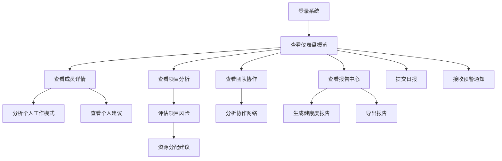

## 1. 产品概述
非侵入式团队健康度仪表盘，通过多维度元数据分析监测团队成员工作状态和项目健康度。
- 解决项目经理无法及时了解团队成员工作状态和项目潜在风险的问题
- 为企业提供数据驱动的团队管理工具，提升项目成功率和团队幸福感

## 2. 核心功能

### 2.1 用户角色
| 角色 | 注册方式 | 核心权限 |
|------|---------|----------|
| 项目经理 | 邮箱注册 | 查看所有团队成员数据，接收预警通知，管理项目，生成报告 |
| 团队成员 | 邮箱注册 | 查看个人数据和健康度指标，提交日报，查看个人建议 |

### 2.2 功能模块
1. **仪表盘页面**：团队健康度概览，成员状态卡片，项目风险预警，实时数据流
2. **成员详情页**：个人工作模式分析，健康度历史趋势，多维度评分，个人建议，MBTI人格分析
3. **项目分析页**：项目进度分析，风险评估，资源分配建议，里程碑追踪
4. **团队协作页**：成员交互分析，沟通效率评估，协作网络图谱
5. **报告中心**：健康度报告生成，历史报告对比，导出功能，自动发送
6. **设置中心**：数据源配置，预警规则设置，团队管理，个人偏好
7. **日报系统**：快速日报提交，AI自动总结，日报历史分析
8. **MBTI分析页**：团队MBTI分布，人格特质分析，团队协作建议

### 2.3 页面详情
| 页面名称 | 模块名称 | 功能描述 |
|---------|---------|----------|
| 仪表盘页面 | 团队健康度概览 | 展示团队整体健康度评分，成员状态分布，近期预警事件，实时数据更新 |
| 仪表盘页面 | 成员状态卡片 | 显示每个团队成员的健康度评分，工作时间分布，最近提交情况，预警标识 |
| 仪表盘页面 | 项目风险预警 | 展示项目中存在的潜在风险，如技术阻塞、进度延迟等，按严重程度排序 |
| 仪表盘页面 | 实时数据流 | 展示最新的团队活动，如代码提交、任务更新等，实时滚动 |
| 成员详情页 | 个人工作模式分析 | 分析个人Git提交时间分布，工作时长，会议占比，代码质量指标等数据 |
| 成员详情页 | 健康度历史趋势 | 展示个人健康度指标的历史变化趋势，识别异常模式，标注关键时间点 |
| 成员详情页 | 多维度评分 | 从工作时长、代码质量、任务进度、会议效率、协作程度五个维度评分 |
| 成员详情页 | 个人建议 | 基于数据分析，提供个性化的工作建议，如调整工作时间、提高代码质量等 |
| 项目分析页 | 项目进度分析 | 分析项目任务完成情况，进度偏差，识别潜在延迟风险，甘特图展示 |
| 项目分析页 | 风险评估 | 基于元数据分析，评估项目面临的技术和人员风险，风险热力图展示 |
| 项目分析页 | 资源分配建议 | 根据团队成员工作负载，提供资源调整建议，工作量分布图 |
| 项目分析页 | 里程碑追踪 | 追踪项目里程碑完成情况，提前预警延迟风险 |
| 团队协作页 | 成员交互分析 | 分析团队成员之间的交互频率、协作模式，识别核心协作人员 |
| 团队协作页 | 沟通效率评估 | 评估团队沟通效率，如会议时长、消息回复率、协作工具使用情况 |
| 团队协作页 | 协作网络图谱 | 可视化展示团队成员之间的协作关系，识别团队结构问题 |
| 报告中心 | 健康度报告生成 | 生成周/月/季度健康度报告，包含团队和个人数据 |
| 报告中心 | 历史报告对比 | 对比不同时期的健康度报告，识别改进和恶化趋势 |
| 报告中心 | 导出功能 | 支持PDF、Excel格式导出报告 |
| 报告中心 | 自动发送 | 设置定时自动发送报告到指定邮箱 |
| 设置中心 | 数据源配置 | 配置Git、Jira、Calendar等数据源连接 |
| 设置中心 | 预警规则设置 | 自定义预警规则，如工作时长阈值、代码质量标准等 |
| 设置中心 | 团队管理 | 管理团队成员，添加/移除成员，分配角色 |
| 设置中心 | 个人偏好 | 设置个人通知偏好、数据展示方式等 |
| 日报系统 | 快速日报提交 | 简化日报提交流程，支持快速填写 |
| 日报系统 | AI自动总结 | 基于当日工作数据，AI自动生成日报摘要 |
| 日报系统 | 日报历史分析 | 分析日报历史，识别工作模式变化 |
| MBTI分析页 | 团队MBTI分布 | 展示团队成员MBTI类型分布，使用饼图和热力图可视化 |
| MBTI分析页 | 人格特质分析 | 分析团队成员的人格特质，包括外向/内向、感觉/直觉、思考/情感、判断/感知四个维度 |
| MBTI分析页 | 团队协作建议 | 基于MBTI分布，提供团队协作和沟通建议，优化团队结构 |
| 成员详情页 | MBTI人格分析 | 展示个人MBTI类型分析，包括详细的人格特质描述和工作风格建议 |

## 3. 核心流程
项目经理登录系统后，首先查看仪表盘页面了解团队整体状态，然后可以点击具体成员查看详细分析，或进入项目分析页评估项目风险。系统会自动分析收集的多维度元数据，当检测到异常模式时，会在仪表盘页面显示预警信息。团队成员可以查看个人健康度数据，提交日报，接收个人工作建议。

## 4. 健康度评估算法

### 4.1 多维度元数据指标
系统收集以下维度的元数据进行健康度评估：

#### 工作时长指标（权重25%）
- 工作时间分布（白天/夜晚/凌晨占比）
- 连续工作时长（防止过劳）
- 工作时长稳定性（每日波动）
- 周末工作频率

#### 代码质量指标（权重20%）
- 代码提交频率
- 代码审查参与度
- 代码问题修复率
- 代码复杂度变化趋势

#### 任务进度指标（权重25%）
- 任务完成率
- 任务按时交付率
- 任务阻塞时长
- 任务优先级分布

#### 会议效率指标（权重15%）
- 会议时长占比
- 会议频率
- 会议参与率
- 会后任务跟进情况

#### 协作程度指标（权重15%）
- 团队沟通频率
- 跨部门协作次数
- 知识分享贡献（文档、代码注释）
- 团队问题解决参与度

### 4.2 评估算法流程
1. **数据标准化**：将各维度指标标准化到0-100分
2. **权重计算**：根据预设权重计算综合评分
3. **趋势分析**：分析历史数据，识别上升/下降趋势
4. **异常检测**：使用统计方法检测异常模式
5. **预警触发**：当指标超出阈值时触发预警

### 4.3 预警规则
- **红色预警（严重）**：健康度<60分，或连续3天凌晨提交，或任务停滞超过5天
- **橙色预警（警告）**：健康度60-75分，或周末工作超过2天，或任务延期超过3天
- **黄色预警（关注）**：健康度75-85分，或工作时长波动超过30%，或会议占比超过40%

## 5. 用户界面设计
### 5.1 设计风格
- 主色调：深蓝色 (#1a237e) 和薄荷绿 (#4db6ac)，体现专业和健康
- 辅助色：橙色 (#ff9800) 用于预警提示，红色 (#f44336) 用于严重警告，灰色 (#f5f5f5) 用于背景
- 按钮风格：圆角矩形，有轻微阴影效果，hover时有颜色变化
- 字体：无衬线字体，主标题18-24px，副标题16px，正文14px
- 布局风格：卡片式布局，清晰的信息层次，充足的留白
- 图标风格：线性图标，简洁现代，使用lucide-react图标库

### 5.2 页面设计概览
| 页面名称 | 模块名称 | UI元素 |
|---------|---------|--------|
| 仪表盘页面 | 团队健康度概览 | 大型健康度评分卡片，使用环形进度条展示，颜色从绿色到红色渐变表示健康度 |
| 仪表盘页面 | 成员状态卡片 | 网格布局的卡片，每个卡片包含成员头像、姓名、健康度评分、最近提交时间、预警状态 |
| 仪表盘页面 | 项目风险预警 | 预警列表，使用不同颜色标识风险等级，点击可查看详情 |
| 仪表盘页面 | 实时数据流 | 垂直滚动的实时活动流，显示最新提交、任务更新等 |
| 成员详情页 | 个人工作模式分析 | 时间分布图表，工作时长统计，会议占比饼图，提交频率折线图，代码质量雷达图 |
| 成员详情页 | 健康度历史趋势 | 折线图展示健康度变化，标注关键时间点和事件 |
| 成员详情页 | 多维度评分 | 雷达图展示五个维度评分，每个维度有详细说明 |
| 成员详情页 | 个人建议 | 卡片式建议列表，每个建议有优先级标识和实施建议 |
| 项目分析页 | 项目进度分析 | 甘特图展示项目进度，任务完成情况条形图，进度偏差指示器 |
| 项目分析页 | 风险评估 | 风险热力图，风险因素雷达图，风险趋势线 |
| 项目分析页 | 资源分配建议 | 资源分配饼图，工作量分布图，建议调整列表 |
| 项目分析页 | 里程碑追踪 | 里程碑卡片，显示完成状态、预计时间、实际时间 |
| 团队协作页 | 成员交互分析 | 交互频率热力图，协作模式图表 |
| 团队协作页 | 沟通效率评估 | 会议时长统计图，消息回复率图表，协作工具使用统计 |
| 团队协作页 | 协作网络图谱 | 力导向图展示成员关系，节点大小表示影响力 |
| 报告中心 | 健康度报告生成 | 报告生成表单，选择时间范围、报告类型 |
| 报告中心 | 历史报告对比 | 报告对比视图，并排展示不同时期报告 |
| 报告中心 | 导出功能 | 导出选项，支持PDF和Excel格式 |
| 设置中心 | 数据源配置 | 数据源连接表单，API密钥输入，测试连接按钮 |
| 设置中心 | 预警规则设置 | 规则设置表单，阈值调整，启用/禁用规则 |

### 5.3 响应式设计
- 桌面优先设计，适配1200px以上屏幕
- 平板适配：768px-1199px，调整卡片布局为2列
- 移动端适配：320px-767px，单列布局，简化图表显示
- 触摸优化：增大点击区域，支持手势操作

### 5.4 3D场景引导
- 无3D场景需求，专注于数据可视化和用户体验