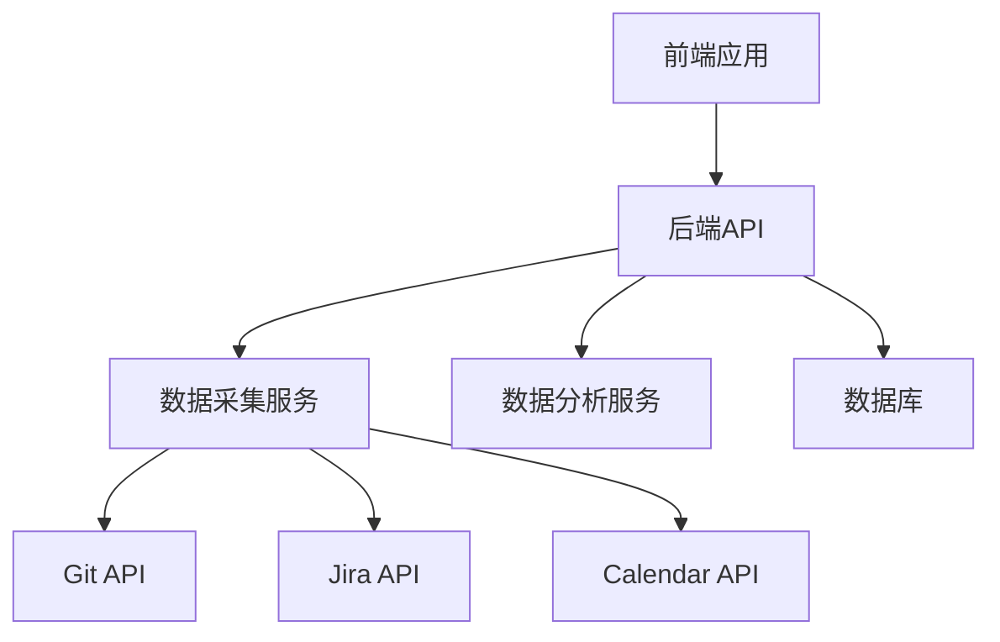
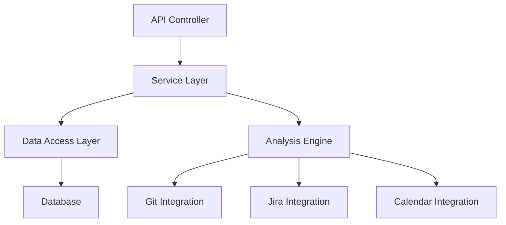
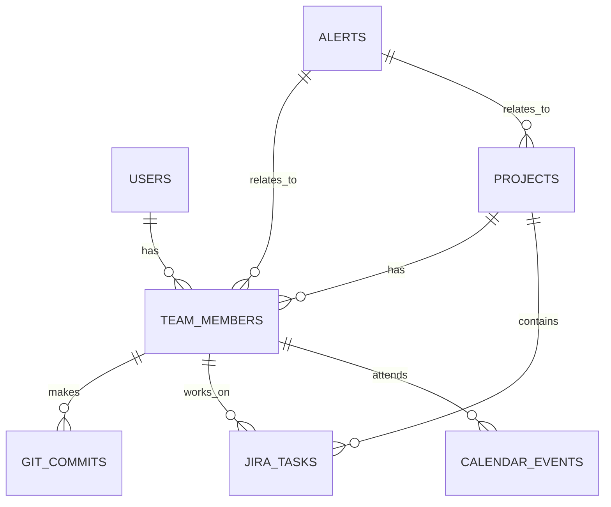

## 1. 架构设计


## 2. 技术描述
- 前端：React@18 + tailwindcss@3 + vite + zustand
- 初始化工具：vite-init
- 后端：Express@4 + TypeScript
- 数据库：PostgreSQL
- 数据采集：RESTful API集成 (Git, Jira, Calendar)
- 数据可视化：Chart.js

## 3. 路由定义
| 路由 | 目的 |
|------|------|
| / | 仪表盘页面 |
| /member/:id | 成员详情页 |
| /project/:id | 项目分析页 |
| /settings | 设置页面 |

## 4. API定义

### 4.1 前端API调用

#### 认证相关
- `POST /api/auth/login` - 用户登录
- `POST /api/auth/register` - 用户注册
- `GET /api/auth/me` - 获取当前用户信息

#### 仪表盘相关
- `GET /api/dashboard/team` - 获取团队健康度概览
- `GET /api/dashboard/members` - 获取所有成员状态
- `GET /api/dashboard/alerts` - 获取预警信息

#### 成员相关
- `GET /api/members/:id` - 获取成员详情
- `GET /api/members/:id/history` - 获取成员健康度历史
- `GET /api/members/:id/patterns` - 获取成员工作模式

#### 项目相关
- `GET /api/projects/:id` - 获取项目详情
- `GET /api/projects/:id/progress` - 获取项目进度
- `GET /api/projects/:id/risks` - 获取项目风险
- `GET /api/projects/:id/resources` - 获取资源分配建议

### 4.2 后端API集成

#### Git API
- 集成GitHub/GitLab API获取提交历史
- 分析提交时间、频率、作者等元数据

#### Jira API
- 集成Jira API获取任务状态变更
- 分析任务完成时间、状态转换频率等

#### Calendar API
- 集成Google Calendar/Outlook API获取会议信息
- 分析会议时长、频率、分布等

## 5. 服务器架构图


## 6. 数据模型

### 6.1 数据模型定义


### 6.2 数据定义语言

#### 用户表
```sql
CREATE TABLE users (
    id SERIAL PRIMARY KEY,
    email VARCHAR(255) UNIQUE NOT NULL,
    password_hash VARCHAR(255) NOT NULL,
    role VARCHAR(50) NOT NULL,
    created_at TIMESTAMP DEFAULT CURRENT_TIMESTAMP
);
```

#### 团队成员表
```sql
CREATE TABLE team_members (
    id SERIAL PRIMARY KEY,
    user_id INTEGER REFERENCES users(id),
    name VARCHAR(255) NOT NULL,
    avatar VARCHAR(255),
    created_at TIMESTAMP DEFAULT CURRENT_TIMESTAMP
);
```

#### Git提交表
```sql
CREATE TABLE git_commits (
    id SERIAL PRIMARY KEY,
    member_id INTEGER REFERENCES team_members(id),
    commit_hash VARCHAR(255) NOT NULL,
    timestamp TIMESTAMP NOT NULL,
    message TEXT,
    created_at TIMESTAMP DEFAULT CURRENT_TIMESTAMP
);
```

#### Jira任务表
```sql
CREATE TABLE jira_tasks (
    id SERIAL PRIMARY KEY,
    member_id INTEGER REFERENCES team_members(id),
    project_id INTEGER REFERENCES projects(id),
    task_id VARCHAR(255) NOT NULL,
    status VARCHAR(50) NOT NULL,
    status_changed_at TIMESTAMP NOT NULL,
    created_at TIMESTAMP DEFAULT CURRENT_TIMESTAMP
);
```

#### 日历事件表
```sql
CREATE TABLE calendar_events (
    id SERIAL PRIMARY KEY,
    member_id INTEGER REFERENCES team_members(id),
    title VARCHAR(255) NOT NULL,
    start_time TIMESTAMP NOT NULL,
    end_time TIMESTAMP NOT NULL,
    created_at TIMESTAMP DEFAULT CURRENT_TIMESTAMP
);
```

#### 项目表
```sql
CREATE TABLE projects (
    id SERIAL PRIMARY KEY,
    name VARCHAR(255) NOT NULL,
    description TEXT,
    created_at TIMESTAMP DEFAULT CURRENT_TIMESTAMP
);
```

#### 预警表
```sql
CREATE TABLE alerts (
    id SERIAL PRIMARY KEY,
    type VARCHAR(50) NOT NULL,
    severity VARCHAR(50) NOT NULL,
    message TEXT NOT NULL,
    member_id INTEGER REFERENCES team_members(id),
    project_id INTEGER REFERENCES projects(id),
    created_at TIMESTAMP DEFAULT CURRENT_TIMESTAMP
);
```

#### 健康度历史表
```sql
CREATE TABLE health_history (
    id SERIAL PRIMARY KEY,
    member_id INTEGER REFERENCES team_members(id),
    score INTEGER NOT NULL,
    timestamp TIMESTAMP NOT NULL,
    created_at TIMESTAMP DEFAULT CURRENT_TIMESTAMP
);
```