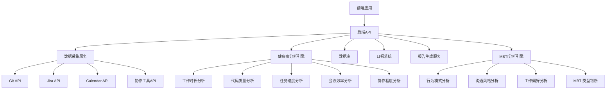
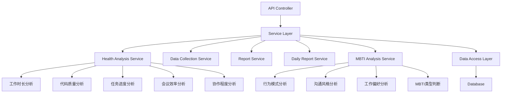
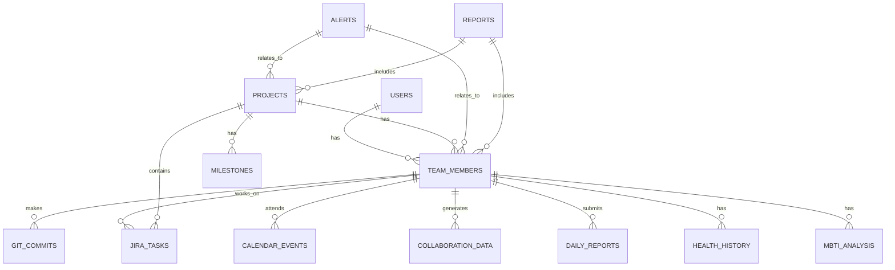

## 1. 架构设计


## 2. 技术描述
- 前端：React@18 + tailwindcss@3 + vite + zustand
- 初始化工具：vite-init
- 后端：Express@4 + TypeScript
- 数据库：PostgreSQL
- 数据采集：RESTful API集成 (Git, Jira, Calendar, 协作工具)
- 数据可视化：Chart.js
- 健康度分析：多维度加权算法 + 趋势分析 + 异常检测
- MBTI分析：基于行为模式的人格类型判断算法

## 3. 路由定义
| 路由 | 目的 |
|------|------|
| / | 仪表盘页面 |
| /member/:id | 成员详情页 |
| /project/:id | 项目分析页 |
| /team | 团队协作页 |
| /reports | 报告中心 |
| /settings | 设置中心 |
| /daily | 日报系统 |
| /mbti | MBTI分析页 |

## 4. API定义

### 4.1 前端API调用

#### 认证相关
- `POST /api/auth/login` - 用户登录
- `POST /api/auth/register` - 用户注册
- `GET /api/auth/me` - 获取当前用户信息

#### 仪表盘相关
- `GET /api/dashboard/team` - 获取团队健康度概览
- `GET /api/dashboard/members` - 获取所有成员状态
- `GET /api/dashboard/alerts` - 获取预警信息
- `GET /api/dashboard/activity` - 获取实时活动流

#### 成员相关
- `GET /api/members/:id` - 获取成员详情
- `GET /api/members/:id/history` - 获取成员健康度历史
- `GET /api/members/:id/patterns` - 获取成员工作模式
- `GET /api/members/:id/scores` - 获取成员多维度评分
- `GET /api/members/:id/suggestions` - 获取成员个人建议

#### 项目相关
- `GET /api/projects` - 获取所有项目列表
- `GET /api/projects/:id` - 获取项目详情
- `GET /api/projects/:id/progress` - 获取项目进度
- `GET /api/projects/:id/risks` - 获取项目风险
- `GET /api/projects/:id/resources` - 获取资源分配建议
- `GET /api/projects/:id/milestones` - 获取项目里程碑

#### 团队协作相关
- `GET /api/team/interactions` - 获取成员交互分析
- `GET /api/team/communication` - 获取沟通效率评估
- `GET /api/team/network` - 获取协作网络数据

#### 报告相关
- `POST /api/reports/generate` - 生成健康度报告
- `GET /api/reports` - 获取历史报告列表
- `GET /api/reports/:id` - 获取报告详情
- `GET /api/reports/:id/export` - 导出报告
- `POST /api/reports/schedule` - 设置报告自动发送

#### 设置相关
- `GET /api/settings/datasources` - 获取数据源配置
- `POST /api/settings/datasources` - 更新数据源配置
- `GET /api/settings/alerts` - 获取预警规则设置
- `POST /api/settings/alerts` - 更新预警规则设置
- `GET /api/settings/team` - 获取团队成员列表
- `POST /api/settings/team` - 管理团队成员
- `GET /api/settings/preferences` - 获取个人偏好
- `POST /api/settings/preferences` - 更新个人偏好

#### 日报相关
- `GET /api/daily` - 获取日报列表
- `POST /api/daily/:id` - 获取日报详情
- `POST /api/daily` - 提交日报
- `GET /api/daily/summary` - 获取AI自动总结
- `GET /api/daily/analysis` - 获取日报历史分析

#### MBTI相关
- `GET /api/mbti/team` - 获取团队MBTI分布
- `GET /api/mbti/member/:id` - 获取成员MBTI分析
- `GET /api/mbti/suggestions` - 获取基于MBTI的团队协作建议

### 4.2 后端API集成

#### Git API
- 集成GitHub/GitLab API获取提交历史
- 分析提交时间、频率、作者、代码变更量、代码审查数据

#### Jira API
- 集成Jira API获取任务状态变更
- 分析任务完成时间、状态转换频率、任务阻塞情况

#### Calendar API
- 集成Google Calendar/Outlook API获取会议信息
- 分析会议时长、频率、参与者、会后任务

#### 协作工具API
- 集成Slack/Teams API获取沟通数据
- 分析消息频率、回复率、协作模式

## 5. 服务器架构图


## 6. 数据模型

### 6.1 数据模型定义


### 6.2 数据定义语言

#### 用户表
```sql
CREATE TABLE users (
    id SERIAL PRIMARY KEY,
    email VARCHAR(255) UNIQUE NOT NULL,
    password_hash VARCHAR(255) NOT NULL,
    role VARCHAR(50) NOT NULL,
    created_at TIMESTAMP DEFAULT CURRENT_TIMESTAMP
);
```

#### 团队成员表
```sql
CREATE TABLE team_members (
    id SERIAL PRIMARY KEY,
    user_id INTEGER REFERENCES users(id),
    name VARCHAR(255) NOT NULL,
    avatar VARCHAR(255),
    position VARCHAR(255),
    created_at TIMESTAMP DEFAULT CURRENT_TIMESTAMP
);
```

#### Git提交表
```sql
CREATE TABLE git_commits (
    id SERIAL PRIMARY KEY,
    member_id INTEGER REFERENCES team_members(id),
    commit_hash VARCHAR(255) NOT NULL,
    timestamp TIMESTAMP NOT NULL,
    message TEXT,
    additions INTEGER DEFAULT 0,
    deletions INTEGER DEFAULT 0,
    files_changed INTEGER DEFAULT 0,
    is_merge BOOLEAN DEFAULT FALSE,
    created_at TIMESTAMP DEFAULT CURRENT_TIMESTAMP
);
```

#### 代码审查表
```sql
CREATE TABLE code_reviews (
    id SERIAL PRIMARY KEY,
    member_id INTEGER REFERENCES team_members(id),
    commit_hash VARCHAR(255) NOT NULL,
    reviewer_id INTEGER REFERENCES team_members(id),
    status VARCHAR(50) NOT NULL,
    comments_count INTEGER DEFAULT 0,
    issues_found INTEGER DEFAULT 0,
    reviewed_at TIMESTAMP NOT NULL,
    created_at TIMESTAMP DEFAULT CURRENT_TIMESTAMP
);
```

#### Jira任务表
```sql
CREATE TABLE jira_tasks (
    id SERIAL PRIMARY KEY,
    member_id INTEGER REFERENCES team_members(id),
    project_id INTEGER REFERENCES projects(id),
    task_id VARCHAR(255) NOT NULL,
    title VARCHAR(255) NOT NULL,
    description TEXT,
    status VARCHAR(50) NOT NULL,
    priority VARCHAR(50),
    story_points INTEGER,
    status_changed_at TIMESTAMP NOT NULL,
    created_at TIMESTAMP DEFAULT CURRENT_TIMESTAMP
);
```

#### 日历事件表
```sql
CREATE TABLE calendar_events (
    id SERIAL PRIMARY KEY,
    member_id INTEGER REFERENCES team_members(id),
    title VARCHAR(255) NOT NULL,
    start_time TIMESTAMP NOT NULL,
    end_time TIMESTAMP NOT NULL,
    duration INTEGER,
    attendees TEXT[],
    has_followup_tasks BOOLEAN DEFAULT FALSE,
    created_at TIMESTAMP DEFAULT CURRENT_TIMESTAMP
);
```

#### 协作数据表
```sql
CREATE TABLE collaboration_data (
    id SERIAL PRIMARY KEY,
    member_id INTEGER REFERENCES team_members(id),
    type VARCHAR(50) NOT NULL,
    content TEXT,
    from_member_id INTEGER REFERENCES team_members(id),
    timestamp TIMESTAMP NOT NULL,
    metadata JSONB,
    created_at TIMESTAMP DEFAULT CURRENT_TIMESTAMP
);
```

#### 项目表
```sql
CREATE TABLE projects (
    id SERIAL PRIMARY KEY,
    name VARCHAR(255) NOT NULL,
    description TEXT,
    start_date TIMESTAMP,
    end_date TIMESTAMP,
    status VARCHAR(50) DEFAULT 'active',
    created_at TIMESTAMP DEFAULT CURRENT_TIMESTAMP
);
```

#### 里程碑表
```sql
CREATE TABLE milestones (
    id SERIAL PRIMARY KEY,
    project_id INTEGER REFERENCES projects(id),
    name VARCHAR(255) NOT NULL,
    description TEXT,
    due_date TIMESTAMP NOT NULL,
    actual_date TIMESTAMP,
    status VARCHAR(50) DEFAULT 'pending',
    created_at TIMESTAMP DEFAULT CURRENT_TIMESTAMP
);
```

#### 预警表
```sql
CREATE TABLE alerts (
    id SERIAL PRIMARY KEY,
    type VARCHAR(50) NOT NULL,
    severity VARCHAR(50) NOT NULL,
    message TEXT NOT NULL,
    member_id INTEGER REFERENCES team_members(id),
    project_id INTEGER REFERENCES projects(id),
    is_resolved BOOLEAN DEFAULT FALSE,
    resolved_at TIMESTAMP,
    created_at TIMESTAMP DEFAULT CURRENT_TIMESTAMP
);
```

#### 健康度历史表
```sql
CREATE TABLE health_history (
    id SERIAL PRIMARY KEY,
    member_id INTEGER REFERENCES team_members(id),
    overall_score INTEGER NOT NULL,
    work_hours_score INTEGER NOT NULL,
    code_quality_score INTEGER NOT NULL,
    task_progress_score INTEGER NOT NULL,
    meeting_efficiency_score INTEGER NOT NULL,
    collaboration_score INTEGER NOT NULL,
    metadata JSONB,
    timestamp TIMESTAMP NOT NULL,
    created_at TIMESTAMP DEFAULT CURRENT_TIMESTAMP
);
```

#### 日报表
```sql
CREATE TABLE daily_reports (
    id SERIAL PRIMARY KEY,
    member_id INTEGER REFERENCES team_members(id),
    content TEXT NOT NULL,
    ai_summary TEXT,
    report_date DATE NOT NULL,
    created_at TIMESTAMP DEFAULT CURRENT_TIMESTAMP
);
```

#### 报告表
```sql
CREATE TABLE reports (
    id SERIAL PRIMARY KEY,
    type VARCHAR(50) NOT NULL,
    title VARCHAR(255) NOT NULL,
    start_date TIMESTAMP NOT NULL,
    end_date TIMESTAMP NOT NULL,
    data JSONB NOT NULL,
    created_by INTEGER REFERENCES users(id),
    created_at TIMESTAMP DEFAULT CURRENT_TIMESTAMP
);
```

#### 数据源配置表
```sql
CREATE TABLE datasource_configs (
    id SERIAL PRIMARY KEY,
    user_id INTEGER REFERENCES users(id),
    type VARCHAR(50) NOT NULL,
    config JSONB NOT NULL,
    is_active BOOLEAN DEFAULT TRUE,
    created_at TIMESTAMP DEFAULT CURRENT_TIMESTAMP
);
```

#### 预警规则表
```sql
CREATE TABLE alert_rules (
    id SERIAL PRIMARY KEY,
    name VARCHAR(255) NOT NULL,
    type VARCHAR(50) NOT NULL,
    condition JSONB NOT NULL,
    severity VARCHAR(50) NOT NULL,
    is_active BOOLEAN DEFAULT TRUE,
    created_at TIMESTAMP DEFAULT CURRENT_TIMESTAMP
);
```

#### MBTI分析表
```sql
CREATE TABLE mbti_analysis (
    id SERIAL PRIMARY KEY,
    member_id INTEGER REFERENCES team_members(id),
    mbti_type VARCHAR(4) NOT NULL,
    extroversion_score INTEGER NOT NULL,
    intuition_score INTEGER NOT NULL,
    feeling_score INTEGER NOT NULL,
    perceiving_score INTEGER NOT NULL,
    behavioral_patterns JSONB,
    communication_style JSONB,
    work_preferences JSONB,
    last_updated TIMESTAMP NOT NULL,
    created_at TIMESTAMP DEFAULT CURRENT_TIMESTAMP
);
```

## 7. 健康度算法实现

### 7.1 权重配置
```typescript
const WEIGHTS = {
  workHours: 0.25,
  codeQuality: 0.20,
  taskProgress: 0.25,
  meetingEfficiency: 0.15,
  collaboration: 0.15
};
```

### 7.2 标准化函数
```typescript
function normalizeScore(value: number, min: number, max: number, invert = false): number {
  let score = ((value - min) / (max - min) * 100;
  if (invert) score = 100 - score;
  return Math.max(0, Math.min(100, score));
}
```

### 7.3 工作时长分析
- 评估工作时间分布，夜间/凌晨工作占比越低得分越高
- 分析连续工作时长，超过10小时扣分
- 检查工作时长稳定性，波动越小得分越高
- 统计周末工作频率，越少得分越高

### 7.4 代码质量分析
- 评估提交频率，适中频率得分高
- 检查代码审查参与度，参与越多得分越高
- 统计问题修复率，修复率越高得分越高
- 分析代码复杂度变化，保持稳定得分高

### 7.5 任务进度分析
- 评估任务完成率，越高越好
- 检查按时交付率，越高越好
- 统计任务阻塞时长，越短越好
- 分析任务优先级分布，合理分布得分高

### 7.6 会议效率分析
- 评估会议时长占比，20-30%最佳
- 检查会议频率，适中得分高
- 统计会议参与率，高参与度得分高
- 分析会后任务跟进情况，有跟进得分高

### 7.7 协作程度分析
- 评估团队沟通频率，适中得分高
- 检查跨部门协作次数，适当协作得分高
- 统计知识分享贡献，贡献越多得分高
- 分析团队问题解决参与度，高参与度得分高

## 8. MBTI分析算法实现

### 8.1 MBTI维度定义
- **E/I**：外向/内向 - 基于社交互动频率、会议参与度、沟通风格
- **S/N**：感觉/直觉 - 基于任务处理方式、代码风格、问题解决方法
- **T/F**：思考/情感 - 基于沟通语气、反馈方式、团队协作模式
- **J/P**：判断/感知 - 基于工作时间管理、任务规划、截止日期处理

### 8.2 数据采集点
- **Git提交**：提交时间、频率、提交信息风格、代码风格
- **Jira任务**：任务处理速度、优先级管理、状态变更频率
- **Calendar事件**：会议参与度、会议时长、会议类型偏好
- **协作工具**：消息频率、回复速度、沟通风格、社交互动

### 8.3 算法实现
```typescript
// MBTI分析算法
function analyzeMBTI(memberData: MemberData): MBTIAnalysis {
  // 计算外向/内向得分
  const extroversionScore = calculateExtroversionScore(memberData);
  
  // 计算感觉/直觉得分
  const intuitionScore = calculateIntuitionScore(memberData);
  
  // 计算思考/情感得分
  const feelingScore = calculateFeelingScore(memberData);
  
  // 计算判断/感知得分
  const perceivingScore = calculatePerceivingScore(memberData);
  
  // 确定MBTI类型
  const mbtiType = determineMBTIType(extroversionScore, intuitionScore, feelingScore, perceivingScore);
  
  return {
    mbtiType,
    extroversionScore,
    intuitionScore,
    feelingScore,
    perceivingScore,
    behavioralPatterns: analyzeBehavioralPatterns(memberData),
    communicationStyle: analyzeCommunicationStyle(memberData),
    workPreferences: analyzeWorkPreferences(memberData)
  };
}

// 计算外向/内向得分
function calculateExtroversionScore(data: MemberData): number {
  // 基于社交互动频率、会议参与度等计算
  return score;
}

// 计算感觉/直觉得分
function calculateIntuitionScore(data: MemberData): number {
  // 基于任务处理方式、代码风格等计算
  return score;
}

// 计算思考/情感得分
function calculateFeelingScore(data: MemberData): number {
  // 基于沟通语气、反馈方式等计算
  return score;
}

// 计算判断/感知得分
function calculatePerceivingScore(data: MemberData): number {
  // 基于工作时间管理、任务规划等计算
  return score;
}

// 确定MBTI类型
function determineMBTIType(e: number, n: number, f: number, p: number): string {
  const e_i = e > 50 ? 'E' : 'I';
  const s_n = n > 50 ? 'N' : 'S';
  const t_f = f > 50 ? 'F' : 'T';
  const j_p = p > 50 ? 'P' : 'J';
  return e_i + s_n + t_f + j_p;
}
```

### 8.4 团队MBTI分析
```typescript
// 团队MBTI分布分析
function analyzeTeamMBTIDistribution(members: MemberData[]): TeamMBTIAnalysis {
  const mbtiTypes = members.map(member => analyzeMBTI(member).mbtiType);
  const distribution = countMBTITypes(mbtiTypes);
  const teamProfile = generateTeamProfile(distribution);
  const collaborationSuggestions = generateCollaborationSuggestions(distribution);
  
  return {
    distribution,
    teamProfile,
    collaborationSuggestions
  };
}
```